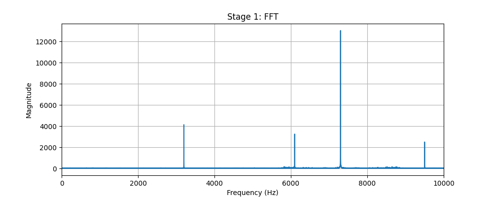
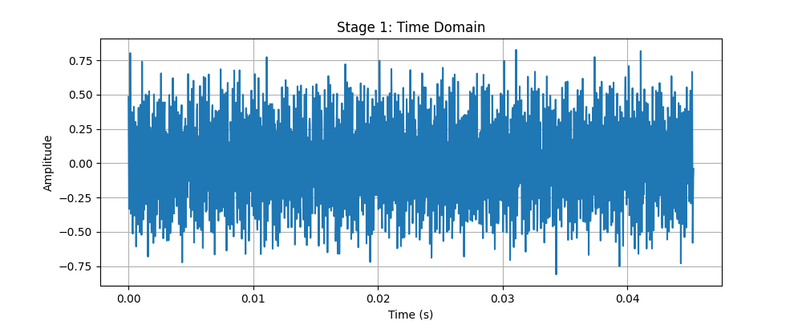
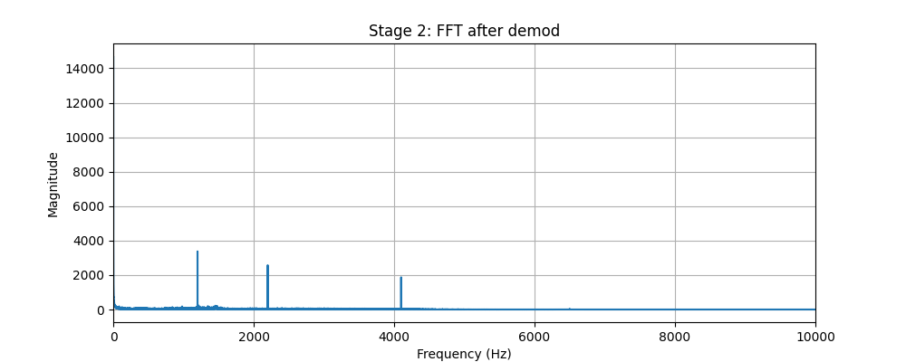
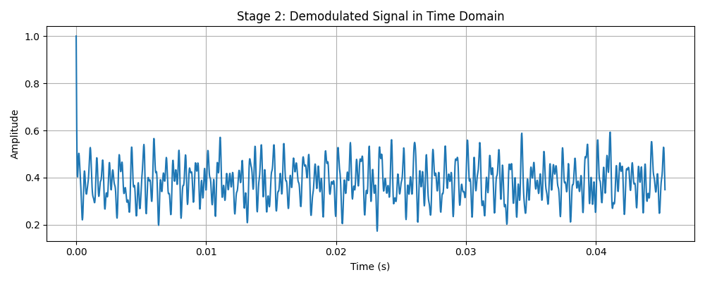
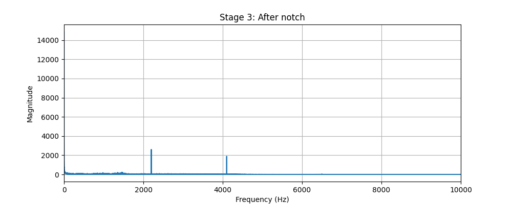
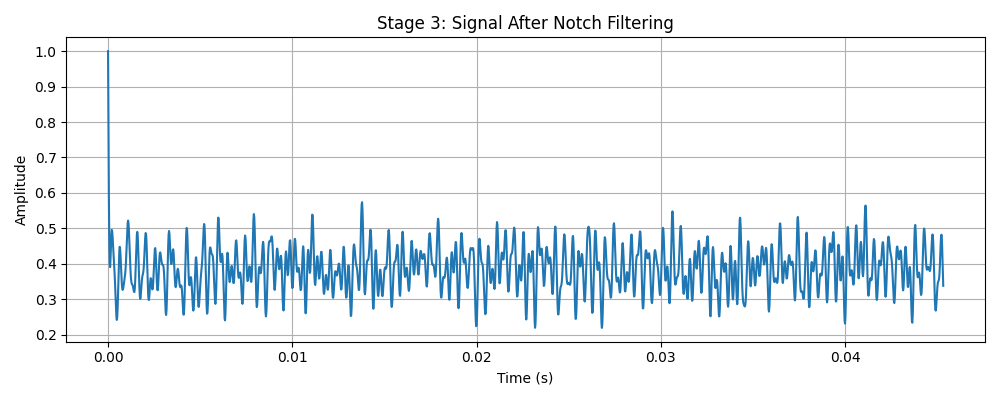
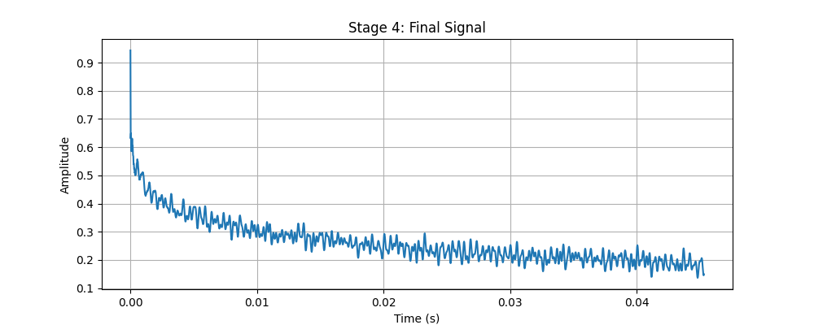

# Signal Processing Task — The Corrupted Transmission

## Overview

This assignment gave me a corrupted audio file (corrupted.wav) and basically said: figure out what happened to it. No hints about how it was corrupted, which honestly made it more interesting but also more frustrating at the start. I ended up using FFT analysis, filtering, and a bit of trial and error to work through it stage by stage.

## Stage 1 — Understanding the Received Signal

The first thing I did was load the signal and plot it in the time domain. It didn't look like anything I immediately recognized — definitely not a clean speech signal.
So I ran an FFT on it. That's when things got clearer. Instead of seeing energy sitting in the 0–4000 Hz range like you'd expect for speech, there was a big concentration of energy up around 7300 Hz. That was the main clue.
My first thought was that the signal had been modulated — multiplied by a cosine at some carrier frequency — which would shift everything up in the spectrum like that. It fit what I was seeing, so I went with it.

- candidate reversed audio 

<audio controls>
  <source src="Signals/candidate_reversed.wav" type="audio/wav">
</audio>

## Stage 2 — Bringing the Signal Back

To undo the frequency shift, I found the peak in the FFT magnitude and used that as my estimate for the carrier frequency. Then I multiplied the corrupted signal by a cosine at that frequency — essentially the reverse of what had been done to it.
After that I put a low-pass filter on it with a cutoff around 4000 Hz to get rid of anything that didn't belong in the speech band.
Plotting the FFT again after this step, the energy was back where it should be. That was a good sign. The demodulation worked.

- candidate negated audio 

<audio controls>
  <source src="Signals/candidate_negated.wav" type="audio/wav">
</audio>

## Stage 3 — Removing Unwanted Components

Even after fixing the frequency shift, I wasn't done. When I looked at the FFT again more carefully, there was this sharp spike sitting around 1200 Hz that really stood out. It was way too narrow and too strong to be part of a natural speech signal.
I figured it was a tone that had been added deliberately as interference. The fix for that is a notch filter, so I set one up centered at 1200 Hz and applied it.
Checked the FFT again — spike was gone. Signal looked a lot cleaner.

- candidate hilbert audio

<audio controls>
  <source src="Signals/candidate_hilbert.wav" type="audio/wav">
</audio>

## Stage 4 — Investigating Remaining Distortion

At this point the FFT magnitude looked fine, but when I listened to the signal it still felt a bit off. I couldn't put my finger on it from the plots alone.
Since the amplitude spectrum looked correct, I started thinking the problem might be in the phase rather than the magnitude. Phase distortion is easy to miss if you're only looking at magnitude plots.
I tried a few different things — the cleaned signal as-is, the inverted version, the time-reversed version, and a Hilbert-based transformation — and just listened to each one to see which sounded most natural. It's not the most rigorous method but for this kind of problem it gets the job done.

![]

- recovered audio -

<audio controls>
  <source src="recovered.wav" type="audio/wav">
</audio>

## Tools and Libraries Used

* Python
* NumPy
* SciPy
* Matplotlib

## Final Summary

From the analysis, the corruption process likely involved:

1. Frequency shifting via modulation with a cosine carrier
2. A narrowband tone added around 1200 Hz as interference
3. Some kind of phase distortion that wasn't visible in the magnitude spectrum

Each issue was identified using FFT and corrected step-by-step using appropriate signal processing techniques.

## Learning from this problem

The biggest thing I learned is that FFT is incredibly useful for diagnosing signal problems — but it only shows you the magnitude. I probably spent longer than I should have staring at plots before I remembered that phase is a whole other dimension of the signal that can be messed with independently. That's something I'll remember for next time.

